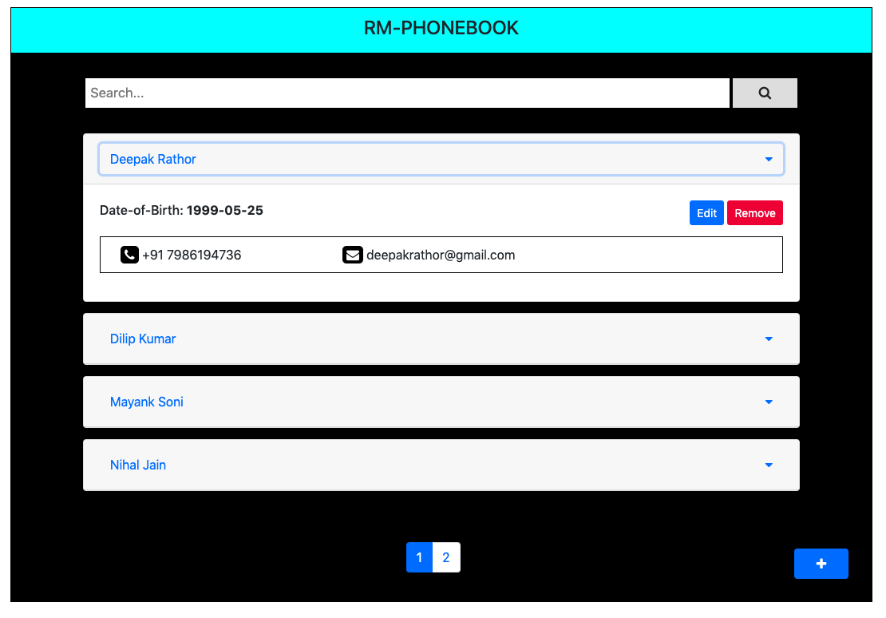
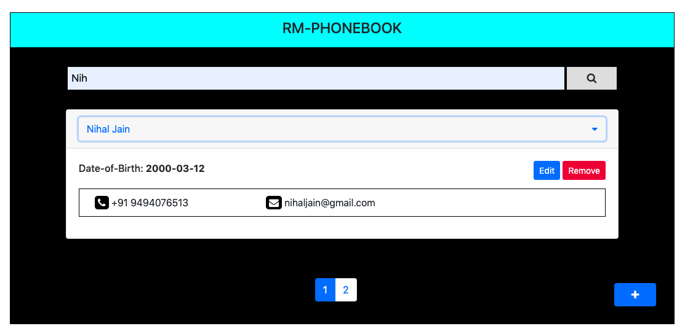
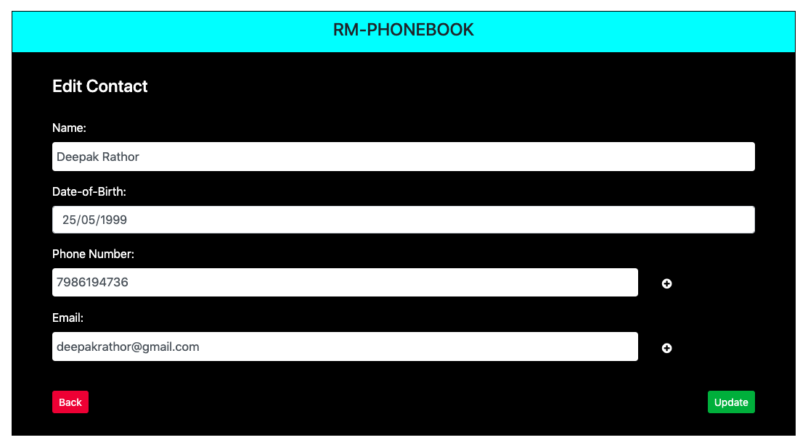

# Phonebook Web App
It is a web based application which basically works as a Contact Manager, where we can perform CRUD operations like create, update, delete and more.

### Operations user can perform
* Add a contact
* Remove a contact
* Update a contact
* Search contact
  * By name (partial name can also be searched)
  * By phone number
  * By email
  * Add pagination with default 4 results per page
  * Search results should be sorted alphabetically (by name).
 
### Contact
* Will have a Name (required)
* Will/Can have multiple phone numbers (should have at least 1 phone number)
* Will/Can have multiple emails
* Will/Can have single Date of birth (not mandatory)

### Constraints
* Two contacts cannot have same phone numbers
* Two contacts can have the same emails.

### Tools or Technologies Used
* PHP
* MySQL
* Bootrap 
* CSS
* Javascript
* Visual Studio Code
* PHPMYADMIN

#### Description:-
The Homepage is fetching all the data from database and sorted in the alphabetically order. I had used *Jumbotron* for better collapsing in which all the details of the person is visible like, Date-of-Birth, Phone Number and Email.

#### Description:-
While searching in a search bar and pressing on the search button the data will get filter based upon the providid string in the search box and it can be searched for multiple times.

#### Description:-
By clicking on Edit button in the callapsed container you can simply update or edit the details and all the detail is being fetched from the database itself and Similarly for the Remove button, if you want to delete the contact then just click on Remove button and the contact will get delete very easily.

#### Description:-
For limiting the responses till '4' I had used the pagination concept which becomes easy to understand and gives better interface to the user.

#### Description:-
For adding new contacts to the diary their is a float button created by which you can add as many new contacts you want with simplicity.

# Thank You
